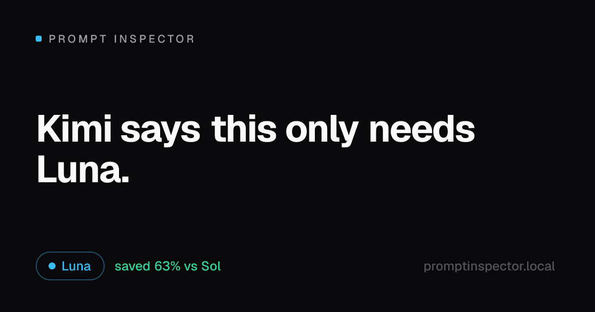
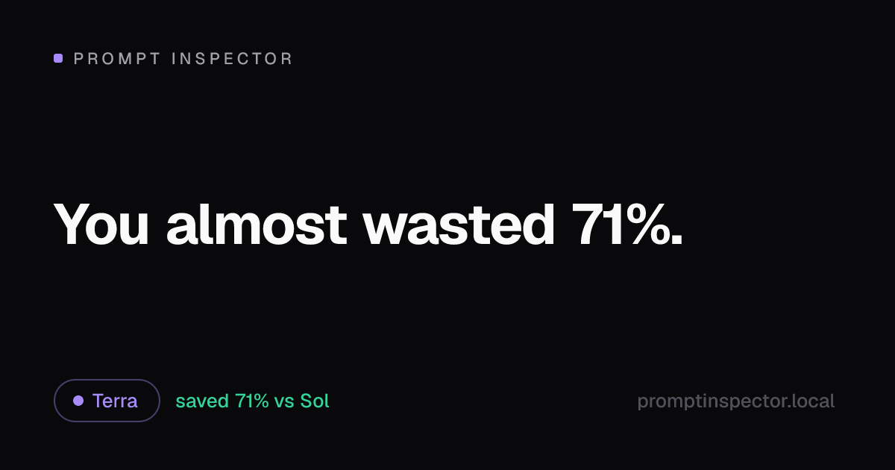

# Prompt Inspector

**Before you spend money asking GPT-5.6... let Kimi inspect your prompt first.**

Prompt Inspector is an OpenAI-compatible intelligent routing proxy. Point your SDK at it
instead of `api.openai.com`, and it inspects every prompt and routes it to the **cheapest
GPT-5.6 tier that can actually answer it** — Luna, Terra, or Sol.

Most developers massively overspend because they default to flagship models.
Prompt Inspector eliminates that waste. Automatically. With receipts.



> The running joke of this project: one of the largest Chinese AI models was used to
> teach OpenAI users how to stop overpaying OpenAI. The humor here is about AI
> competition and economics — nothing else.

## Why this exists

```
Your prompt:  "Classify this review as positive or negative: 'loved it'"
Your model:   gpt-5.6-sol        → $0.0024
Kimi says:    this only needs Luna → $0.0001   (96% cheaper, same answer)
```

Multiply that by every "summarize this", "extract these dates", and "translate this
string" call in your production traffic. That's the waste Prompt Inspector eats.

## Quickstart (5 minutes, no API key needed)

```bash
git clone https://github.com/JacobRyan258/prompt-inspector.git
cd prompt-inspector
pnpm install
pnpm dev        # web on :3000, proxy on :4000
```

- Open **http://localhost:3000** — paste a prompt, get an instant inspection. No login.
- Open **http://localhost:3000/dashboard** — it ships with 14 days of seeded demo data
  so every chart works immediately. Your real traffic replaces it as it arrives.
- The proxy runs in **demo mode** without keys: fully labeled simulated responses, real
  routing decisions, real logging. Everything in the product works end-to-end.

Requires Node ≥ 20 and pnpm.

## Use it as a proxy

One-line change. Everything else — streaming, tool calling, images, the Responses API —
keeps working.

```ts
import OpenAI from "openai";

const client = new OpenAI({
  baseURL: "http://localhost:4000/v1", // ← the only change
});

const res = await client.chat.completions.create({
  model: "gpt-5.6-auto", // let the router pick the tier
  messages: [{ role: "user", content: "Extract the dates from this email: ..." }],
});
```

```bash
curl http://localhost:4000/v1/chat/completions \
  -H "content-type: application/json" \
  -d '{"model":"gpt-5.6-auto","messages":[{"role":"user","content":"Translate hello to Spanish"}]}'
```

Model field controls routing:

| Model | Behavior |
| --- | --- |
| `gpt-5.6-auto` | Inspect the prompt, route to the cheapest sufficient tier |
| `gpt-5.6-luna` / `-terra` / `-sol` | Force a tier (decision still logged — powers waste detection) |

Headers: `x-prompt-inspector-tier: luna|terra|sol` forces a tier;
`x-prompt-inspector-project: my-app` tags spend by project.

### Going live (real upstream models)

`gpt-5.6-luna/terra/sol` are routing tiers. Map each to a real model your provider offers:

```bash
# apps/proxy/.env (or repo-root .env)
OPENAI_API_KEY=sk-...
OPENAI_BASE_URL=https://api.openai.com   # any OpenAI-compatible endpoint works
INSPECTOR_MODEL_LUNA=gpt-4.1-mini
INSPECTOR_MODEL_TERRA=gpt-4.1
INSPECTOR_MODEL_SOL=o3
```

Unset tiers simply serve demo responses — the proxy never crashes on missing config.

## Features

- **🧠 Inspect a Prompt** — paste any prompt: recommended tier, reasoning level,
  confidence, estimated latency/tokens/cost, and *why*.
- **💰 Cost Comparison** — every inspection prices all three tiers and tells you
  "You would spend 63% more using Sol."
- **⚡ Prompt Optimizer** — concrete rewrites (trim few-shot bloat, drop
  deep-think instructions, cap output length) that move your prompt to a cheaper
  tier, with projected savings. The rewrite is one click away.
- **🚦 API Auto Router** — OpenAI-compatible proxy: Chat Completions + Responses API,
  streaming, tool calling, images. No SDK changes beyond the base URL.
- **📊 Spending Dashboard** — spend, saved, savings %, daily trend, model
  distribution, project breakdown, routing history. Screenshot-ready out of the box.
- **🔍 Decision Inspector** — every request explains itself:
  *"Luna because: under 400 tokens · classification task · no coding · low reasoning requirement."*
- **🎯 Challenge the Router** — force Luna/Terra/Sol on the same prompt, compare
  outputs side by side, and see whether spending more bought anything.
- **📈 Waste Detection** — spots traffic riding Sol that the classifier would have
  sent cheaper: *"Estimated unnecessary spend: $143/month."*
- **📦 Benchmark Runner** — 30 prompts across 10 categories (coding, architecture,
  extraction, summarization, translation, reasoning, math, long context, tool
  calling, writing), each runnable across all tiers.
- **🤖 Demo Mode** — no API key required, anywhere. Virality matters.
- **🖼 Share Cards** — every result can generate a card: *"Kimi says this only needs
  Luna."* · *"You almost wasted 71%."* · *"This prompt has been financially audited."*



## The tiers

Pricing lives in one place — [`packages/core/src/pricing.ts`](packages/core/src/pricing.ts) —
and is configuration, not gospel. Change it to match your provider.

| Tier | Vibe | Input / 1M | Output / 1M |
| --- | --- | ---: | ---: |
| **Luna** | Fast & cheap — classification, extraction, summaries, simple Q&A | $0.40 | $1.60 |
| **Terra** | The workhorse — coding, writing, translation, solid reasoning | $2.50 | $10.00 |
| **Sol** | Flagship — architecture, hard math, deep multi-step reasoning | $12.00 | $36.00 |

## How routing works

The classifier is **deterministic heuristics, not an LLM call** — inspecting a prompt
costs $0 and ~0ms, works offline in demo mode, and can explain itself honestly. It
scores signals (token count, task type, code presence, multi-part structure,
deep-reasoning instructions, output-length demands, tool calling, images, capability
floors) and maps the score to a tier. Every signal that fires becomes a human-readable
reason — that's what powers the Decision Inspector.

An LLM classifier could tell you *"Luna"*. Ours tells you *"Luna because: under 400
tokens, classification task, no coding, low reasoning requirement."*

## Architecture

pnpm + Turborepo monorepo, TypeScript everywhere.

```
apps/
  web/          Next.js 15 — landing + playground, dashboard, challenge, benchmarks, OG cards
  proxy/        Fastify 5  — OpenAI-compatible endpoints, the only DB writer
packages/
  core/         @prompt-inspector/core — classifier, optimizer, pricing, benchmarks, SQLite
.data/          SQLite (WAL), created on first use, gitignored
```

Data flow: `SDK → proxy (inspect → route → upstream → log) → SQLite → dashboard`.
The playground never touches the DB or an API key — inspection is pure computation.

## Development

```bash
pnpm dev        # web (:3000) + proxy (:4000) with watch
pnpm build      # build all
pnpm test       # core engine tests + proxy smoke tests
pnpm db:seed    # seed/reseed 14 days of demo dashboard data (-- --force)
```

## Roadmap (architecture-ready, deliberately not built yet)

Multi-provider routing (Claude, Gemini, Grok, Kimi, OpenRouter, Anthropic),
team workspaces, hosted cloud version. The tier table and upstream mapping were
designed for exactly this future.

## License

MIT — see [LICENSE](LICENSE).

---

*Built by a very large Chinese model with strong opinions about your OpenAI bill.*
